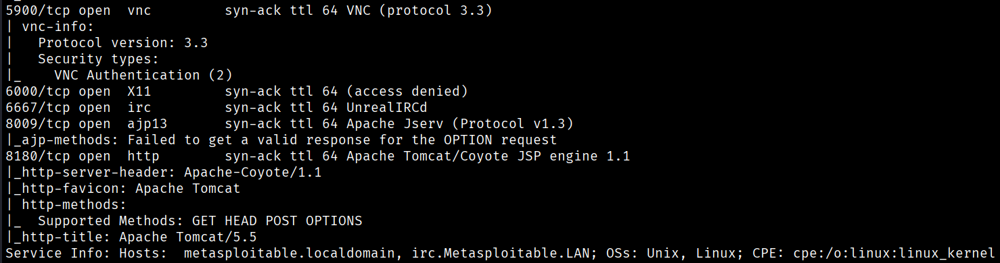

# Network Scanning & Enumeration

This section covers **network discovery**, **port scanning**, and **service enumeration** performed as part of the CYART VAPT lab.  
All scans were executed from **Kali Linux** against **local vulnerable machines** (DVWA, Metasploitable2, others).

Below are the exact commands used and the corresponding screenshots.

---

## 1. Discovering Live Hosts (Ping Sweep)
**Command used:**

```bash
nmap 192.168.56.0/24 -sn
```

**Purpose:**
- Finds active hosts in the network
- Identifies target IPs for further scanning


---

### 2. Port Scanning
```
sudo nmap -p- -sV -sC --min-rate=1000 -oA ~/VAPT_Project/evidence/scan-all-ports 192.168.56.101 -vv
```
- **-p-** for full port scanning (0-65535)
- **-sV** for version detection
- **-sC** runs default Nmap scripts during the scan
-  **--min-rate=1000** sets the minimum packet send rate to 1000 packets per second.




---

### 3. Nikto Web Server Scanning
Nikto is used for web vulnerability scanning on HTTP services.
```
nikto -h http://192.168.56.101:80
nikto -h http;//192.168.56.101:8180
```


---

### Wappalyzer Technology Fingerprinting
**Command (Browser Plugin):**
- Used the Wappalyzer browser extension to identify:
- Web technologies
- Server type
- Frameworks
- Programming languages
- CMS
- JavaScript libraries

**Purpose:**
Helps understand the technology stack and potential weaknesses.


---

### Shodan OSINT Review (No Attacks)
To compare the lab service with real-world exposure, Shodan data was referenced.

**Shodan information includes:**
- Exposed ports (e.g., 25, 2121)
- Detected services like ProFTPD, Postfix
- SSL certificate metadata
- Host fingerprinting


### Shodan Reconnaissance Findings
Timestamp            | Tool    | Finding
-------------------- |---------|--------------------------------------------------------------
2025-12-07 15:45:05  | Shodan  | Detected ProFTPD 1.3.1 on port 2121 (Metasploitable)
2025-12-07 09:33:20  | Shodan  | Detected Postfix SMTP on port 25 (Metasploitable)
2025-12-07 15:45:05  | Shodan  | SSL Certificate: ubuntu804-base.localdomain (Self-signed)
2025-12-07 15:45:05  | Shodan  | Exposed FTP service with weak banner metadata
2025-12-07 15:45:05  | Shodan  | Host geolocation: Bengaluru, India (ACT Fibernet)

---

# DVWA Instances — Summary Report

This report summarizes publicly accessible **Damn Vulnerable Web Application (DVWA) v1.10** instances detected across different countries, organizations, and cloud providers.  

---

## DVWA Instance Details

| Timestamp (UTC)       | IP Address        | Host / Org                               | Country                      | Web Server               | PHP / Tech         | Notes                        |
|----------------------|-----------------|-----------------------------------------|-------------------------------|--------------------------|-------------------|-------------------------------|
| 2025-12-12 01:38:17  | 74.48.86.33     | MULTACOM CORPORATION                     | United States (Los Angeles)   | Apache/2.4.25 (Debian)  | PHP/7.0.30        | DVWA Login Page               |
| 2025-12-12 01:00:24  | 23.95.191.218   | HostPapa                                 | United States (Buffalo)       | Apache/2.4.25 (Debian)  | PHPSESSID cookie  | DVWA Login Page               |
| 2025-12-12 00:20:47  | 114.66.48.36    | Beijing Yunlin Network Technology Co.,Ltd | China (Ningbo)              | Apache/2.4.65 (Debian)  | PHPSESSID cookie  | DVWA Login Page               |
| 2025-12-11 21:54:48  | 52.23.11.119    | Amazon Technologies Inc.                 | United States (Ashburn)       | Apache/2.4.25 (Debian)  | PHP 7.x           | DVWA Login Page               |
| 2025-12-11 21:02:49  | 118.89.67.238   | Tencent Cloud Computing                  | China (Shanghai)              | Apache/2.4.25 (Debian)  | PHPSESSID cookie  | DVWA Setup Page               |
| 2025-12-11 20:14:39  | 139.59.47.58    | DigitalOcean, LLC                        | India (Doddaballapura)        | nginx/1.14.0 (Ubuntu)   | PHPSESSID cookie  | DVWA Login Page + SSL (Let's Encrypt) |
| 2025-12-11 19:33:42  | 8.219.172.146   | Alibaba Cloud                            | Singapore                     | nginx/1.28.0             | PHP/8.1.33        | DVWA Login Page               |
| 2025-12-11 18:46:47  | 130.213.203.114 | Microsoft Limited                         | United States (Boydton)      | Apache/2.4.25 (Debian)  | PHPSESSID cookie  | DVWA Login Page               |
| 2025-12-11 18:42:41  | 202.157.185.99  | PT. Exabytes Network Indonesia           | Indonesia (Jakarta)           | Apache/2.4.25 (Debian)  | PHPSESSID cookie  | DVWA Login Page               |
| 2025-12-11 18:32:04  | 61.63.11.90     | KBT Co., LTD                             | Taiwan (Taipei)               | —                        | JSESSIONID cookie | DVWA Login Page + SSL (ZeroSSL) |

---

## Top Countries

| Country                | Count |
|-----------------------|-------|
| United States          | 121   |
| China                  | 58    |
| Korea (Republic of)    | 23    |
| Germany                | 16    |
| Hong Kong              | 14    |

---

## Top Ports

| Port | Count |
|------|-------|
| 80   | 177   |
| 8080 | 54    |
| 443  | 29    |
| 1971 | 13    |
| 81   | 7     |

---

## Top Organizations

| Organization                    | Count |
|---------------------------------|-------|
| Amazon Technologies Inc.        | 39    |
| Microsoft Corporation           | 27    |
| Amazon Data Services NoVa       | 17    |
| Google LLC                      | 17    |
| DigitalOcean, LLC               | 16    |

---

## Top Products

| Product         | Count |
|-----------------|-------|
| Apache httpd    | 233   |
| nginx           | 38    |

---


## Subdomain Enumeration (Sublist3r)
Target: metasploitable.localdomain, DVWA
Tools: Sublist3r, Amass

**Result:**
No public subdomains identified because the target is an isolated lab machine with no DNS footprint.

**Conclusion:**
OSINT phase completed – no external exposure detected for subdomains.
