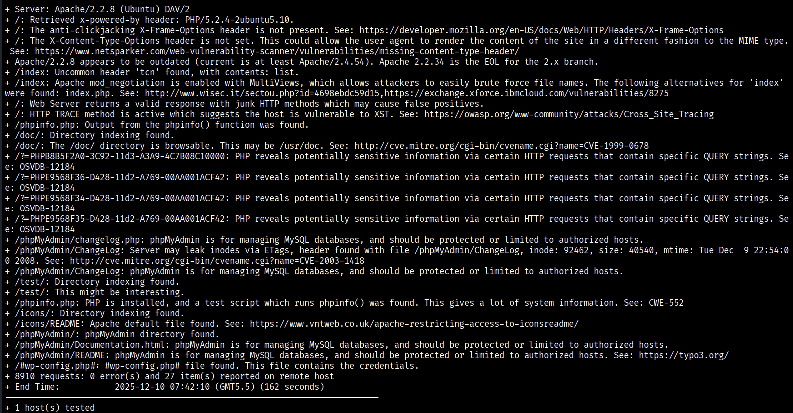
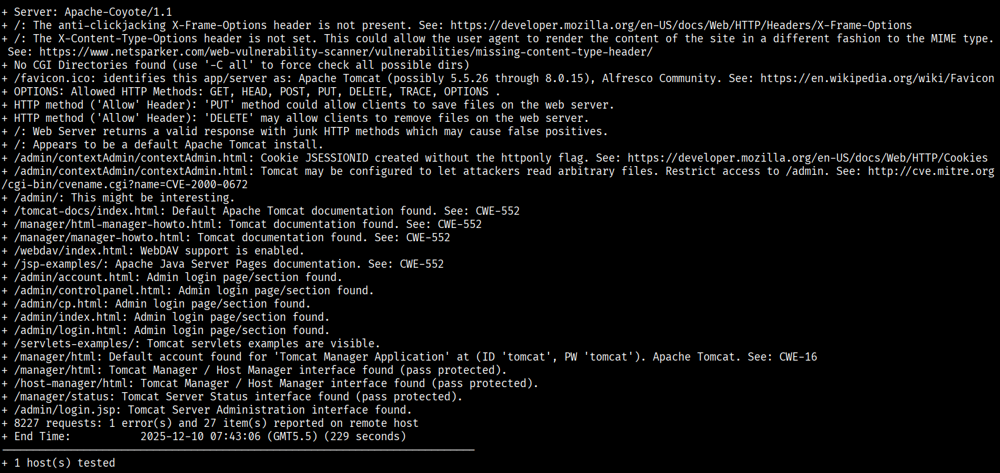

# Network Scanning & Enumeration

This section covers **network discovery**, **port scanning**, and **service enumeration** performed as part of the CYART VAPT lab.  
All scans were executed from **Kali Linux** against **local vulnerable machines** (DVWA, Metasploitable2, others).

Below are the exact commands used and the corresponding screenshots.

---

## 1. Discovering Live Hosts (Ping Sweep)
**Command used:**

```bash
nmap 192.168.56.0/24 -sn
```

**Purpose:**
- Finds active hosts in the network
- Identifies target IPs for further scanning


### 2. Port Scanning
```
sudo nmap -p- -sV -sC --min-rate=1000 -oA ~/VAPT_Project/evidence/scan-all-ports 192.168.56.101 -vv
```
- **-p-** for full port scanning (0-65535)
- **-sV** for version detection
- **-sC** runs default Nmap scripts during the scan
-  **--min-rate=1000** sets the minimum packet send rate to 1000 packets per second.


---

### 3. Nikto Web Server Scanning
Nikto is used for web vulnerability scanning on HTTP services.
```
nikto -h http://192.168.56.101:80
nikto -h http;//192.168.56.101:8180
```




---

### Wappalyzer Technology Fingerprinting
**Command (Browser Plugin):**
- Used the Wappalyzer browser extension to identify:
- Web technologies
- Server type
- Frameworks
- Programming languages
- CMS
- JavaScript libraries

**Purpose:**
Helps understand the technology stack and potential weaknesses.


